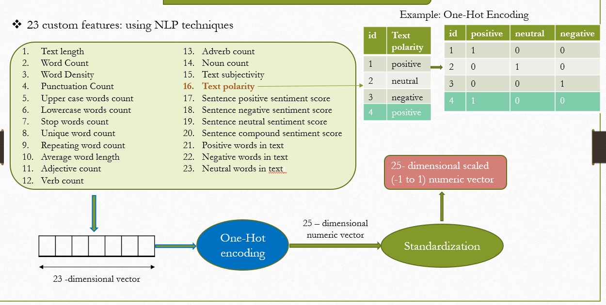
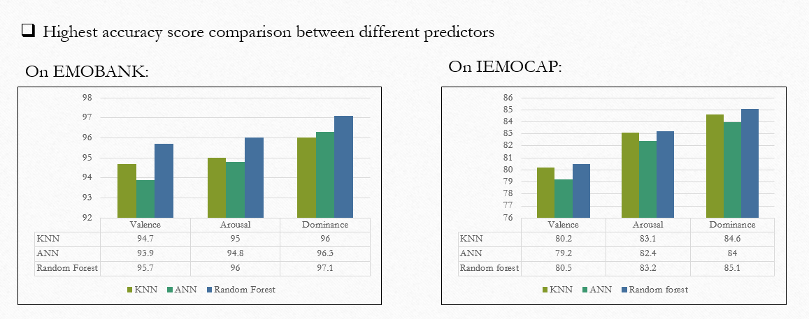
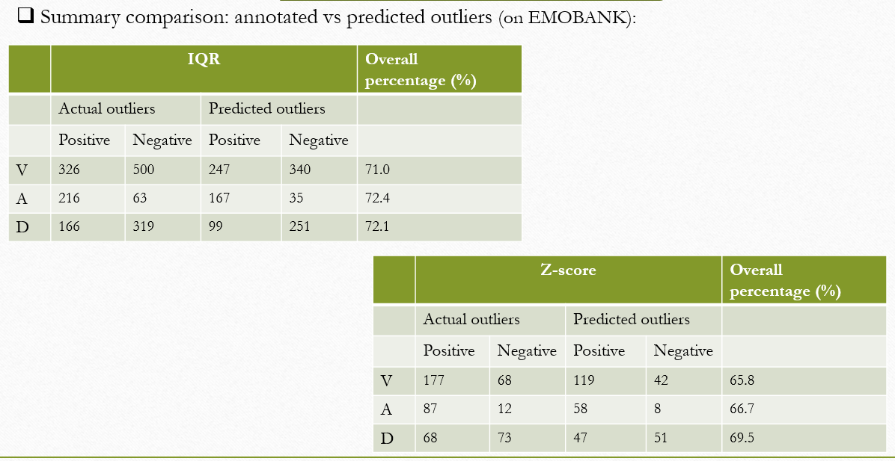

# 🎭 Emotion Analysis using NLP

## 📌 Project Overview

This project focuses on **sentiment and emotion analysis** from text using NLP techniques.  
The system predicts emotional dimensions and compares multiple machine learning models to evaluate performance.

We use handcrafted linguistic features and statistical methods to analyze emotional patterns in text.

---

## ⚙ Custom Feature Engineering

We extract **23 NLP-based custom features**, including:

- Word & sentence statistics  
- POS-based features (noun, verb, adjective, adverb)  
- Sentiment polarity  
- Positive, negative, and neutral word counts  

  

---

## 📊 Result Analysis

Performance comparison of different models on emotion prediction tasks.

  

---

## 🔍 Outlier Detection Analysis

Comparison between **annotated and predicted outliers** using  
**IQR and Z-score statistical methods**.

  

---

## 🏆 Key Highlights

- Machine learning models show strong predictive performance  
- Custom NLP features improved accuracy  
- Statistical outlier detection enhanced reliability  

---

> **Note:** Figures and screenshots are taken from our research work and developed by the authors.
